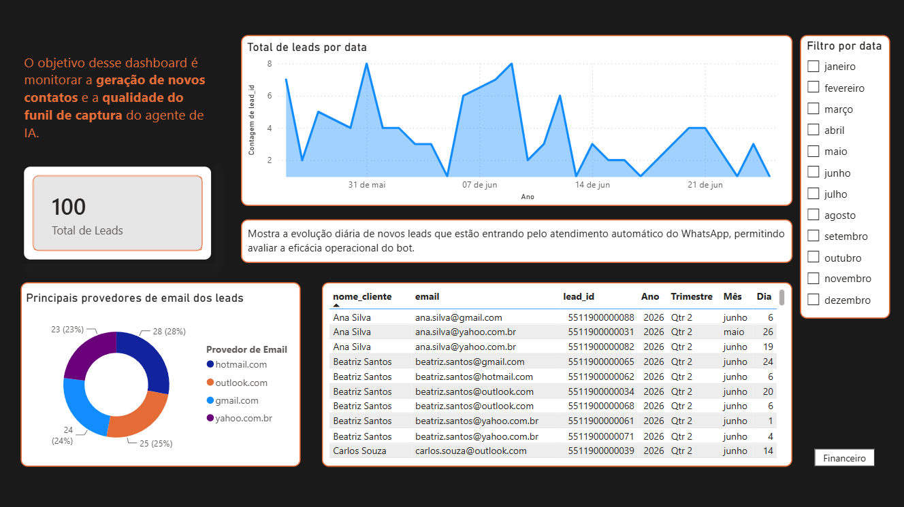
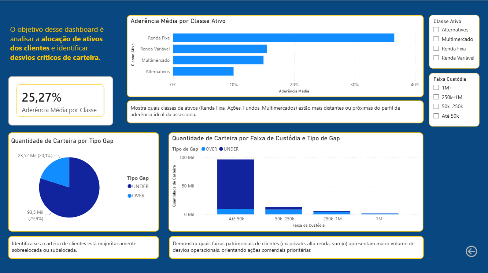

# Modern Analytics Engineering Pipeline (dbt + Supabase + Power BI)

Este repositório apresenta um pipeline completo de Analytics Engineering desenvolvido para transformar dados brutos transacionais e operacionais, armazenados no PostgreSQL do Supabase, em um Data Warehouse estruturado sob modelagem dimensional (Star Schema) pronto para consumo de Business Intelligence no Power BI.

O projeto utiliza o dbt (Data Build Tool) para orquestrar as transformações de dados em camadas lógicas (Staging e Marts), aplicando testes automatizados de qualidade de dados (Data Quality Tests) para garantir a integridade das métricas de negócios antes de sua exibição nos relatórios executivos.

## Arquitetura do Pipeline de Analytics

```
  [Supabase (public)] ---> [dbt (Staging - Views)] ---> [dbt (Marts - Tables)] ---> [Power BI Desktop]
   (Tabelas Brutas)         (Limpeza & Padronizacao)     (Fatos e Dimensoes)       (Relatorio Executivo)
```

## Estrutura do Repositório

O projeto dbt foi modularizado seguindo as melhores práticas de engenharia de análise:
```
analytics-engineering-dbt-powerbi/
├── .env.example            # Modelo de variaveis de ambiente de conexao
├── .gitignore              # Regras de exclusao do controle de versao
├── requirements.txt        # Dependencias e bibliotecas (dbt-postgres)
├── gerar_dados_ficticios.py # Script utilitario para geracao e carga de dados de teste
└── dbt_analytics_bdr/
    ├── dbt_project.yml     # Configuracoes principais do projeto dbt
    └── models/
        ├── sources.yml     # Declaracao formal das tabelas de origem (Sources)
        ├── schema.yml      # Declaracao dos testes de qualidade de dados (Data Tests)
        ├── staging/        # Camada de higienizacao e padronizacao (Views)
        │   ├── stg_contas_gaps.sql
        │   └── stg_leads_minerva.sql
        └── marts/          # Camada de negocio dimensional (Tabelas Fisicas)
            ├── dim_clientes.sql
            └── fact_gaps_carteira.sql
```

## Camadas de Transformação e Modelagem

### 1. Camada de Ingestão e Fontes (Sources)

As tabelas brutas de produção localizadas no esquema public são declaradas formalmente no arquivo sources.yml. Isso permite que o dbt mapeie a linhagem dos dados e execute testes diretamente na origem, isolando a produção das transformações.

### 2. Camada de Staging (Views)

Os modelos de staging aplicam uma limpeza inicial rápida:
- Padronização de nomes de colunas usando termos claros de negócios.
- Conversão e coerção de tipos de dados.
- Seleção estrita apenas das colunas úteis, gerando Views (stg_contas_gaps e stg_leads_minerva) no banco de dados.

### 3. Camada de Negócios (Marts - Fatos e Dimensões)

Para otimizar o desempenho de leitura dos relatórios no Power BI, as tabelas finais da camada core são materializadas de forma física (materialized='table') no esquema analytics:
- dim_clientes: Consolida os dados descritivos dos clientes que interagiram com o atendimento automático.
- fact_gaps_carteira: Armazena as métricas transacionais de alocação de ativos e aderência de carteira para análise financeira de desvios.

## Controle de Qualidade de Dados (Data Tests)

O projeto implementa testes de integridade declarativos executados diretamente no banco de dados para garantir a consistência das dimensões e fatos:
- Unique: Garante a ausência de chaves primárias duplicadas em dim_clientes.
- Not Null: Impede o processamento de registros sem chaves de identificação ou sem variáveis críticas como tipo_gap.
- Accepted Values: Valida que a coluna tipo_gap armazene estritamente os domínios válidos de negócio (OVER ou UNDER).

## Instruções de Instalação e Execução

### Pré-requisitos

- Python 3.11 ou 3.12 (venv ativa)
- Banco de dados PostgreSQL configurado (Supabase)
- Java JDK 17 (Eclipse Temurin) configurado no ambiente local

### 1. Instalação e Ativação do Ambiente
```
py -3.12 -m venv venv
.\venv\Scripts\activate
pip install -r requirements.txt
```

### 2. Configurar o Perfil de Conexão do dbt

Crie ou edite o seu arquivo de conexões localizado em ~/.dbt/profiles.yml (na pasta de usuário do Windows) com a seguinte configuração:
```
dbt_analytics_bdr:
  outputs:
    dev:
      type: postgres
      host: db.jwdetrionquopohsqlqw.supabase.co
      user: postgres
      password: sua_senha_do_supabase
      port: 5432
      dbname: postgres
      schema: analytics
      threads: 4
  target: dev
```

### 3. Executar as Transformações e os Testes

Navegue até a pasta do dbt (cd dbt_analytics_bdr) e execute:
```
# Compilar e criar as views de staging e as tabelas fisicas de marts
dbt run

# Executar todas as validacoes de qualidade de dados configuradas
dbt test
```

## Camada de Visualização (Power BI)

O relatório executivo conecta-se diretamente ao esquema `analytics` do Supabase para consumir as tabelas físicas prontas, organizadas sob a seguinte lógica de negócio:

### Aba 1: Painel Operacional (Agente Minerva)
Focado no monitoramento de volume de contatos capturados pelo atendimento automatizado da Minerva, histórico de atração de novos leads e distribuição de contatos por domínios cadastrais.



### Aba 2: Painel Financeiro (Gaps de Alocação)
Focado na distribuição de desvios e gaps de alocação por classe de ativos, índice de aderência média das contas modelo e cruzamento de gaps (OVER/UNDER) por faixa de custódia patrimonial dos clientes.

